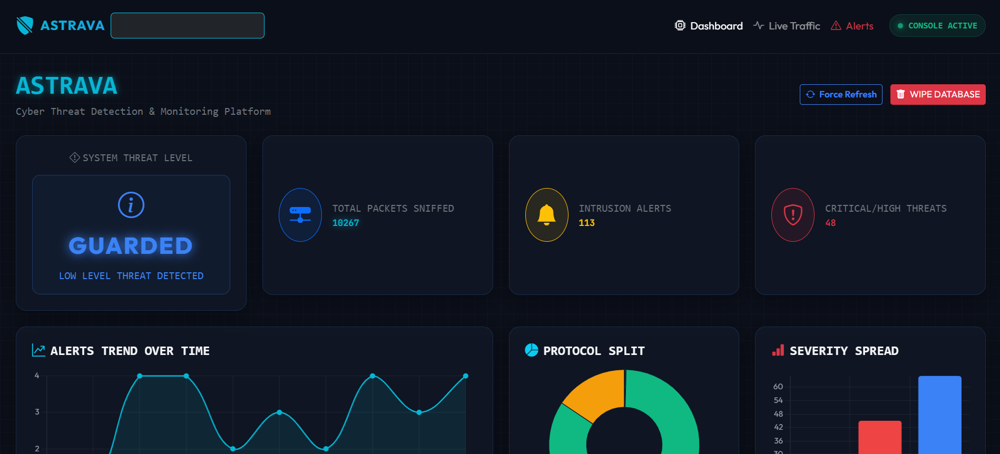
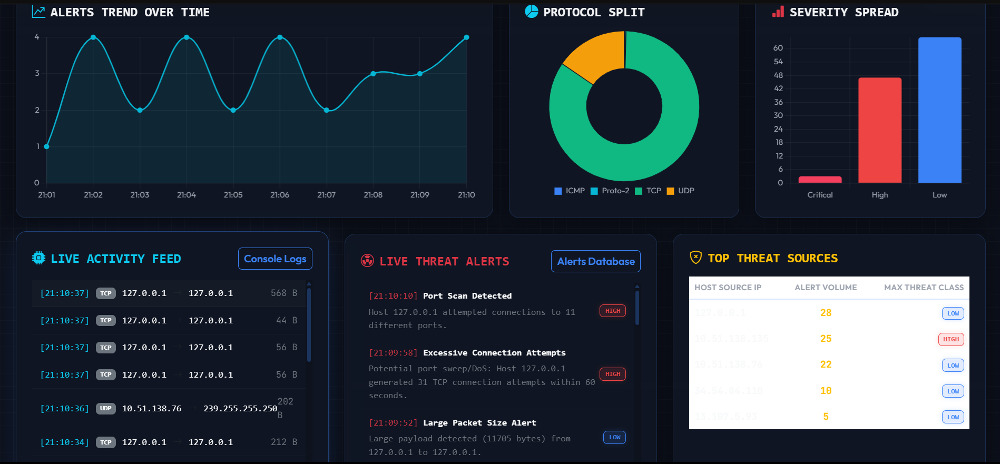
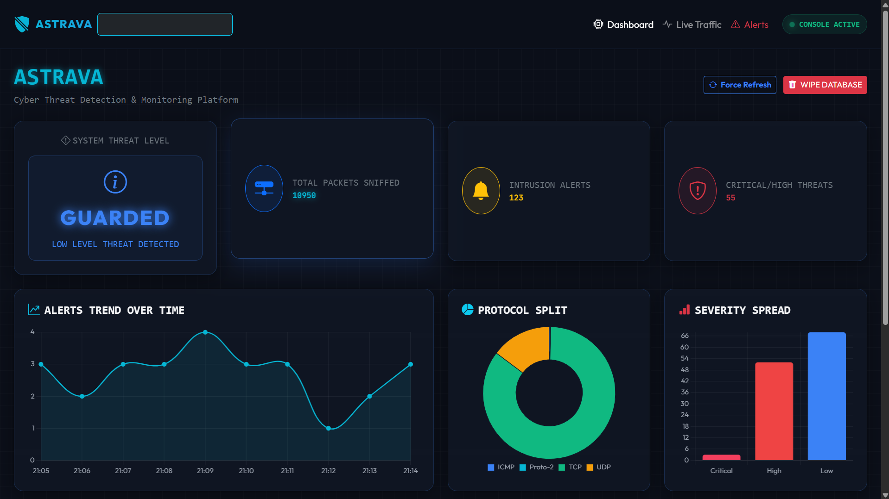

#  ASTRAVA – Cyber Threat Detection & Monitoring Platform

ASTRAVA is a real-time cybersecurity monitoring platform that captures network traffic, analyzes packets, detects suspicious activities, and visualizes security events through an interactive web dashboard.

Developed as part of the Elevate Labs project program, ASTRAVA combines packet sniffing, threat detection, security analytics, and live monitoring into a single platform.

---

##  Features

###  Live Packet Monitoring

* Captures real-time network traffic using Scapy.
* Monitors TCP, UDP, ICMP, and other IP-based protocols.
* Logs packet metadata including source, destination, protocol, and size.

###  Threat Detection Engine

ASTRAVA includes multiple detection rules:

* Port Scan Detection
* Excessive TCP Connection Attempts
* ICMP Flood Detection
* DNS Tunneling Detection
* Suspicious Port Activity Detection
* Large Payload Detection
* Insecure Protocol Usage Detection (Telnet)

###  Security Analytics Dashboard

* Real-time protocol distribution
* Alert severity analysis
* Threat activity timeline
* Top threat source identification
* Live packet feed
* Live security alert feed

###  Database Logging

* Stores captured packets in SQLite.
* Stores generated alerts with severity classification.
* Maintains historical records for analysis.

---

##  System Architecture

Network Traffic
↓
Scapy Packet Sniffer
↓
Threat Detection Engine
↓
SQLite Database
↓
Flask Backend API
↓
Interactive Security Dashboard

---

##  Technology Stack

* Python
* Flask
* Scapy
* SQLAlchemy
* SQLite
* HTML
* CSS
* JavaScript

---

##  Screenshots

### Dashboard Overview



### Security Analytics



### Live Activity Feed



### Top Threat Sources


---

##  Project Structure

```text
ASTRAVA/
│
├── app.py
├── sniffer.py
├── detector.py
├── models.py
├── database.py
├── requirements.txt
│
├── templates/
│   ├── index.html
│   ├── packets.html
│   └── alerts.html
│
├── static/
│   ├── css/
│   └── js/
│
├── screenshots/
│
└── README.md
```

##  Installation

1. Clone the repository

```bash
git clone https://github.com/113vab/astrava-ids.git
cd astrava-ids
```

2. Install dependencies

```bash
pip install -r requirements.txt
```

3. Run the application

```bash
python app.py
```

4. Open the dashboard

```text
http://127.0.0.1:5000
```

---

##  Key Learning Outcomes

* Network Packet Analysis
* Threat Detection Techniques
* Intrusion Detection Concepts
* Flask Web Development
* Database Management
* Security Analytics Visualization
* Cybersecurity Monitoring Workflows

---

##  Future Improvements

* Machine Learning Based Threat Detection
* Geo-IP Intelligence Integration
* Email Alerting System
* PDF Security Reports
* User Authentication & RBAC
* Threat Intelligence Feed Integration

---

##  Author

Vaibhav Vishal

Project developed as part of the Elevate Labs Cybersecurity Project Program.
